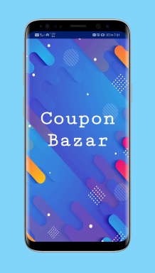

# Coupon Bazar mobile app  by DevBots

## Team name: DevBots
## Members : 
* Vansh Bulani   
* Ashwath    
* Vishal
## Track : Open Innovation
*Website's code is pushed on the branch'OurWebsite"*

[click here for our power-point presentation](coupon%20bazor_final.pdf)

### **Problem statement :**

*Coupons can be really helpful while buying online products but people don't have time to find it and it's difficult too.*

### **Abstract :**

*So analyzing the problem stated in the previous slide, our team came up with a solution, Coupons can be very helpful economically but people don't give much attention to it because sometimes coupons of a particular brand gets difficult to find. So we built a coupon trading android application and a web application  from which people can buy and sell coupons and vouchers according to their needs.*

### **The User Experience :**

* **Splash Screen**

* **Signup & Login**

* **About us Tab**
*--This Tab is to show the user about our app*

* **Add sale Tab**
*--In this Tab the user can add the coupon they want to sell, with the details and selling price of the coupon*

* **Buy Tab**
*--In this Tab all the user can see the coupons which are for sale and by clicking the respective coupon ,the user will be directed to a Razorpay payment gateway.When the payment is success the user can see his coupon details in My Coupons Tab*

* **Manage sale Tab**
*--In this Tab the user can view and delete the coupons he is selling*

* **My Coupons Tab**
*--In this Tab the user can the coupons he bought with their coupon code*

* **Contact us Tab**
*--This Tab will be used by the user to countact the Admin*

